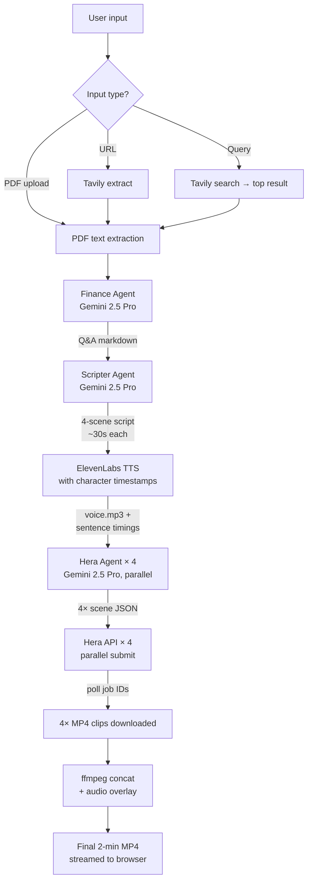

# CorpuScan

> AI analyst-producer that turns quarterly reports into short, clear executive video briefings.

Upload a quarterly report (PDF), an investor update, paste a URL, or just type a query — CorpuScan extracts what actually matters, writes a narrated script, and renders a 2-minute boardroom-ready explainer video.

The value is not "making video." The value is **turning dense information into clear communication**.

---

## Positioning

- *Turn quarterly reports into 2-minute executive video briefings.*
- *AI agent for explaining company reports visually.*
- *Upload a report, get a boardroom-ready video summary.*

## Target users

- Investor relations teams
- Founders & finance teams
- Internal communications teams
- Strategy & analyst teams

---

## How it works



---

## Tech stack

| Layer                | Tool                                              |
| -------------------- | ------------------------------------------------- |
| Frontend             | React 18 + Vite + TypeScript + Tailwind CSS       |
| UI scaffold          | Built with Lovable (see `docs/lovable-prompt.md`) |
| UI components        | shadcn/ui + lucide-react                          |
| Backend              | FastAPI (Python 3.12), managed with `uv`          |
| LLM reasoning        | Google Gemini 2.5 Pro via `google-genai` SDK      |
| Research agent       | Tavily Search + Extract API                       |
| Voiceover            | ElevenLabs TTS (`/with-timestamps` endpoint)      |
| Motion graphics      | Hera Motion API (`docs.hera.video`)               |
| Video composition    | ffmpeg (system binary, called via subprocess)     |
| Frontend hosting     | Vercel                                            |
| Backend hosting      | Railway or Fly.io (single always-on container)    |
| Database             | **None** — in-memory job state                    |
| Queue                | **None** — `asyncio.create_task` per request      |
| File storage         | **None** — `/tmp/{job_id}/` + streamed response   |
| Auth                 | **None** — public demo, no signup                 |

---

## Architecture decisions

- **No database.** Job state lives in an in-memory `dict` on the FastAPI process. A demo session = one job. If the server restarts mid-job, the job is lost. Acceptable for MVP.
- **No queue.** The full pipeline (~60–180s) runs in a single `asyncio` background task per request. Frontend polls `GET /jobs/{id}` every 1.5s.
- **No auth.** Landing page → "Start now" → dashboard → upload. No accounts, no history.
- **No persistent file storage.** Final MP4 is streamed directly from `/tmp` to the browser; user downloads. No S3, no Vercel Blob.
- **All third-party keys are server-side.** Frontend never touches Gemini, Tavily, ElevenLabs, or Hera directly.

---

## Repo layout

```
.
├── README.md            ← this file
├── PRD.md               ← product requirements
├── TASK.md              ← build checklist
├── CLAUDE.md            ← entry point for Claude Code
├── AGENTS.md            ← conventions for any AI coding agent
├── docs/
│   ├── lovable-prompt.md   ← paste this into Lovable to scaffold the frontend
│   ├── branding.md         ← brand voice + color tokens
│   └── agent-prompts.md    ← system prompts for Finance / Scripter / Hera agents
├── frontend/            ← React + Vite + Tailwind (generated by Lovable)
└── backend/             ← FastAPI + uv
```

---

## Local development

```bash
# Backend
cd backend
uv sync
cp .env.example .env       # fill in GEMINI_API_KEY, TAVILY_API_KEY, ELEVENLABS_API_KEY, HERA_API_KEY
uv run uvicorn app.main:app --reload --port 8000

# Frontend
cd frontend
pnpm install
echo "VITE_API_BASE_URL=http://localhost:8000" > .env.local
pnpm dev
```

System dependency: **ffmpeg** must be on `PATH`. Install via `brew install ffmpeg` (macOS) or `apt install ffmpeg` (Debian/Ubuntu / Docker base image).

---

## Demo flow

1. Open the landing page → **Start now**.
2. Drag a quarterly report PDF (or paste a URL, or type "Apple Q4 2025 earnings").
3. Click **Generate video**.
4. Watch the 6-step pipeline indicator tick through (~2 minutes).
5. Embedded video player loads. **Download MP4**.

---

## Status

Hackathon MVP — see [TASK.md](TASK.md) for the live checklist.
